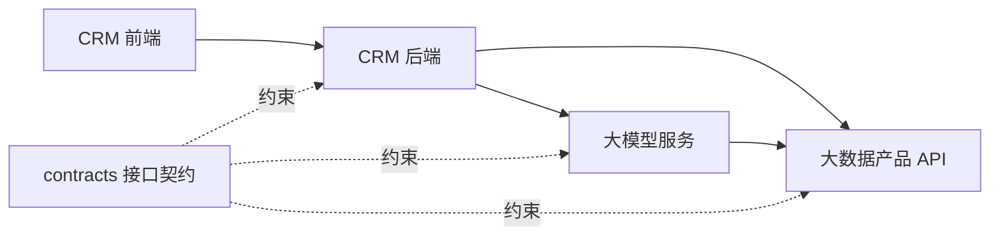

# 仓库架构说明

## 1. 架构选择

本项目采用“单仓库、三业务域、多个独立部署单元”的结构。统一仓库便于接口联调、版本追踪和团队协作；独立构建边界可以防止 CRM、大数据和大模型代码互相依赖成一个难以发布的整体。

```text
个金营销 NL2SQL 平台
├── crm                      客户关系管理系统
│   ├── frontend             Web 前端
│   └── backend              Spring Boot 后端
├── data-product             大数据产品
│   ├── api-service          查询、元数据等在线服务
│   ├── batch-jobs           离线计算任务
│   ├── realtime-jobs        实时计算任务
│   ├── sql                  建表、视图和数据加工 SQL
│   └── quality              数据质量规则与测试
├── llm-service              大模型服务
│   ├── app                  服务代码
│   ├── prompts              提示词及版本说明
│   ├── evaluation           标准问题集和评测代码
│   └── tests                自动化测试
├── contracts                OpenAPI、事件和公共数据结构
├── deploy                   容器与环境部署说明
├── docs                     项目文档
└── scripts                  不含敏感信息的开发辅助脚本
```

依赖方向如下：



系统间通过明确的 HTTP、RPC 或消息契约交互，不允许一个系统直接引用另一个系统的内部源码。CRM 后端不应直连大模型服务所使用的内部存储，大模型服务也不能绕过数据产品的权限控制直接访问生产明细库。

## 2. CRM 系统

### 前端

建议按业务功能组织，而不是把所有页面、接口和状态分别堆在全局目录中：

```text
crm/frontend/src/
├── app/                     路由、全局布局、启动配置
├── features/
│   ├── conversation/        NL2SQL 对话
│   ├── customer/            客户关系
│   ├── marketing/           营销分析
│   └── knowledge-admin/     术语和指标配置
├── shared/                  通用组件、工具和请求封装
└── assets/
```

### Spring Boot 后端

建议采用“按业务模块分包，模块内部再分层”的方式：

```text
crm/backend/src/main/java/<基础包名>/
├── Nl2SqlApplication.java
├── customer/
│   ├── api/                 Controller、请求和响应对象
│   ├── application/         用例编排、事务边界
│   ├── domain/              业务规则和领域对象
│   └── infrastructure/      数据库及外部服务实现
├── conversation/
├── marketing/
├── knowledge/
├── authorization/
└── common/                  仅放真正跨模块的基础能力
```

不要建立无限增长的全局 `controller/`、`service/`、`mapper/` 目录。按业务模块放置代码，能让开发成员明确修改边界，也便于后续拆分服务。

## 3. 大数据产品

- `api-service/`：对外提供受控的查询、元数据、指标和任务状态接口；若采用 Java，可使用 Spring Boot 独立工程。
- `batch-jobs/`：Spark、Hive 等离线任务；按业务主题建立子目录，每个任务可独立构建。
- `realtime-jobs/`：Flink 等实时任务，与离线任务分开管理。
- `sql/`：按 `ddl/`、`dml/`、`view/` 分类，并按版本记录变更。
- `quality/`：数据完整性、唯一性、及时性和口径一致性规则。

严禁将真实生产数据、查询结果导出文件或带客户信息的调试样例提交到 Git。

## 4. 大模型服务

```text
llm-service/app/
├── api/                     对外接口
├── application/             NL2SQL 用例编排
├── domain/                  意图、查询要素、规则等核心模型
├── infrastructure/          模型、向量库、元数据等适配实现
├── guardrails/              SQL 只读、权限和复杂度校验
└── observability/           指标、追踪和脱敏日志
```

- `prompts/` 中的提示词必须有版本和变更说明，不写真实客户信息。
- `evaluation/` 保存脱敏标准问题、期望结果和评测工具；SQL 质量以结果一致性为主要判断依据。
- 权限叠加、SQL 白名单和只读限制不能只依靠模型提示，必须由可信服务端执行。

## 5. 跨系统契约

所有跨系统变更先进入 `contracts/`：

- REST 接口使用 OpenAPI 文件。
- 消息使用 AsyncAPI 或 JSON Schema。
- 错误码、分页、请求追踪字段由契约统一约定。
- 契约变更需标明兼容性；破坏性变更应新增主版本，不直接覆盖旧接口。

禁止在 `contracts/` 中共享业务实现类或数据库实体，避免形成源码级耦合。

## 6. 构建和发布边界

每个部署单元必须具备自己的构建文件、测试、镜像文件和 README。一次代码提交可以触发按目录判断的构建：

| 变更目录 | 建议执行 |
|---|---|
| `crm/frontend/**` | 前端检查、测试、构建 |
| `crm/backend/**` | Maven 测试、打包、镜像构建 |
| `data-product/**` | 对应服务或任务测试与打包 |
| `llm-service/**` | Python 检查、测试、安全与效果回归 |
| `contracts/**` | 契约校验及全部受影响系统的兼容性测试 |

初期只有少量成员时，不要预先拆成大量微服务。先保持清楚的模块边界，只有在发布频率、容量、安全边界或团队职责确实不同时再拆分部署单元。
