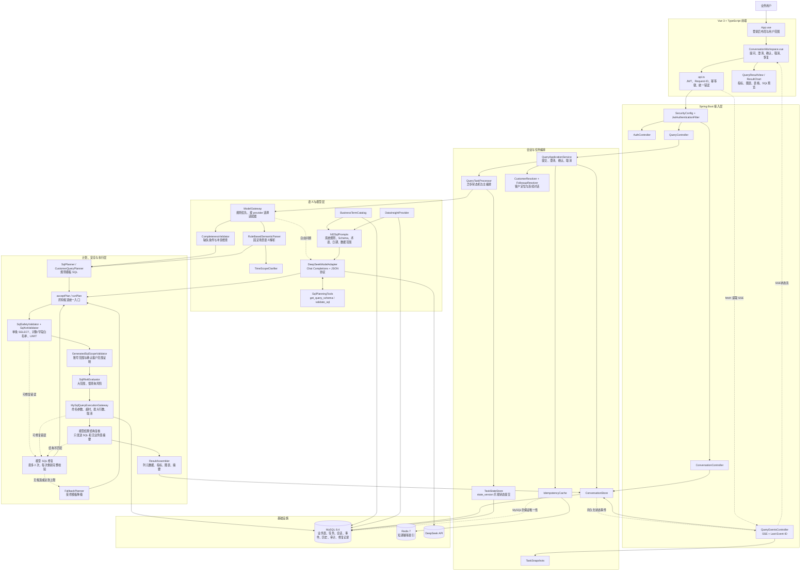
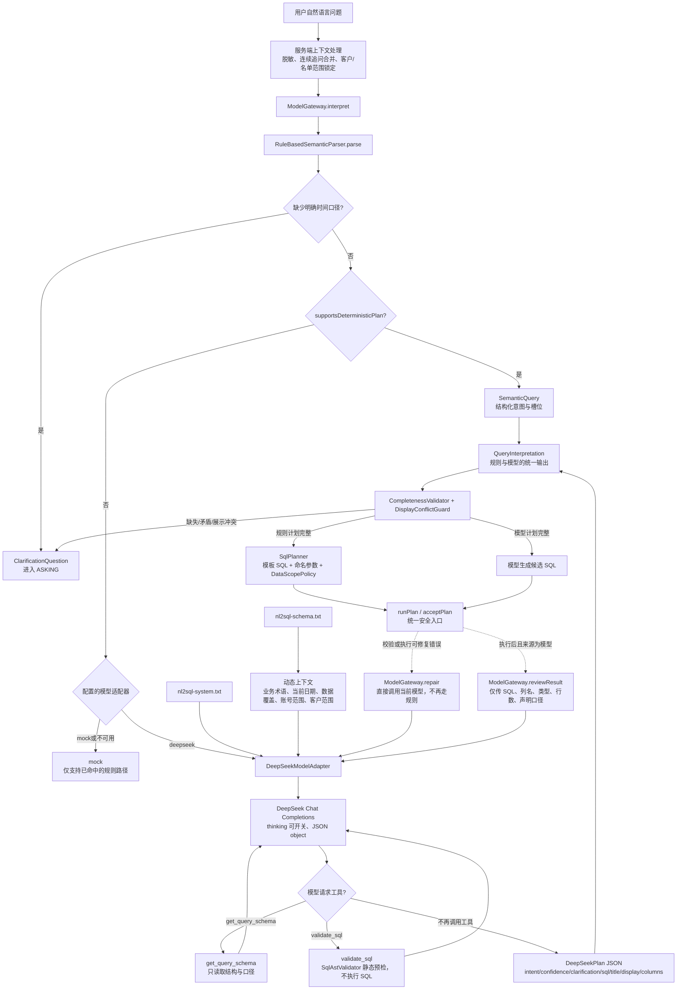
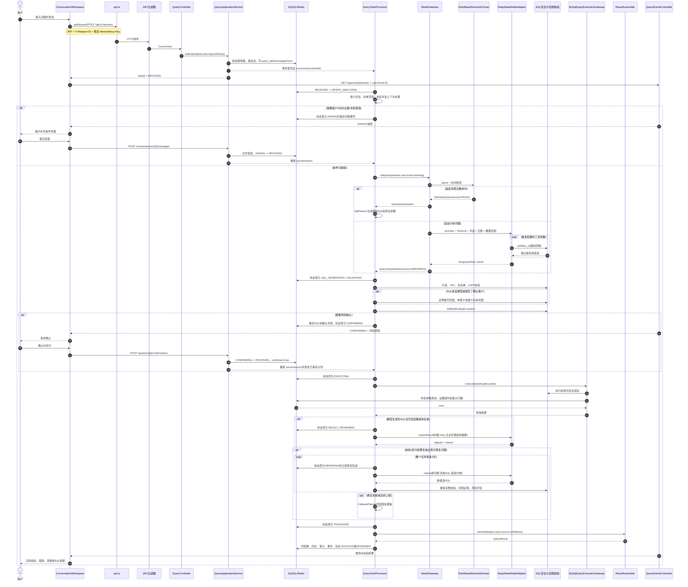
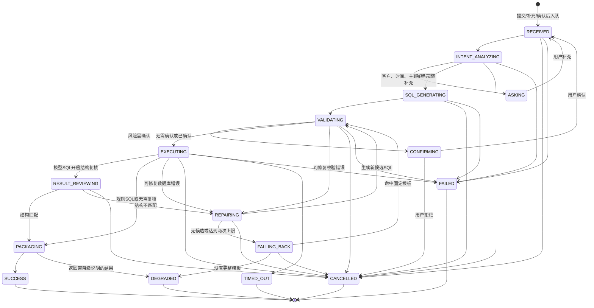

# 代码架构与调用图

本文根据 v1.5 当前代码整理。项目没有训练或托管自研神经网络；运行时采用“确定性规则优先、DeepSeek 处理自由问题、可信服务端负责安全与执行”的混合架构。`llm-service/` 和 `data-product/` 当前主要是扩展位置，可运行实现集中在 `crm/backend/`。

## 1. 整体架构

## 2. 模型与 NL2SQL 内部架构

模型在系统里的权限边界：

- 模型可以读取允许查询的 Schema、业务术语、当前账号必须具备的数据范围，以及无客户明细的数据覆盖信息。
- 模型可以生成候选 `SELECT`、提出澄清问题、声明列角色和推荐展示方式。
- 模型工具只能做静态检查，不能执行数据库查询。
- 模型不能决定最终权限，不能绕过确认，也不能把思考正文作为 SQL 或结果使用。
- 每条模型 SQL、修复 SQL 和降级 SQL 都重新进入服务端安全及风险检查。

## 3. 一次查询的完整调用时序

## 4. 查询任务状态机

## 5. 读代码时的对应入口

| 关注点 | 主要代码 |
|---|---|
| 前端请求、JWT、幂等键 | `crm/frontend/src/app/api.ts` |
| 前端提问、SSE、澄清、确认 | `crm/frontend/src/features/conversation/ConversationWorkspace.vue` |
| HTTP查询接口 | `conversation/api/QueryController.java` |
| SSE事件回放 | `conversation/api/QueryEventsController.java` |
| 提交、澄清、确认、取消 | `conversation/application/QueryApplicationService.java` |
| 查询主编排与修复闭环 | `conversation/application/QueryTaskProcessor.java` |
| 规则优先和模型路由 | `model/ModelGateway.java` |
| DeepSeek协议、工具调用、修复和复核 | `model/DeepSeekModelAdapter.java` |
| 提示词动态上下文 | `model/Nl2SqlPrompts.java` |
| 固定规则SQL | `execution/application/SqlPlanner.java` |
| AST和范围证明 | `execution/application/SqlAstValidator.java`、`GeneratedSqlScopeValidator.java` |
| 风险确认 | `execution/application/SqlRiskEvaluator.java` |
| MySQL执行、超时和取消 | `execution/infrastructure/MySqlQueryExecutionGateway.java` |
| 结果指标、图表和摘要 | `execution/application/ResultAssembler.java` |

